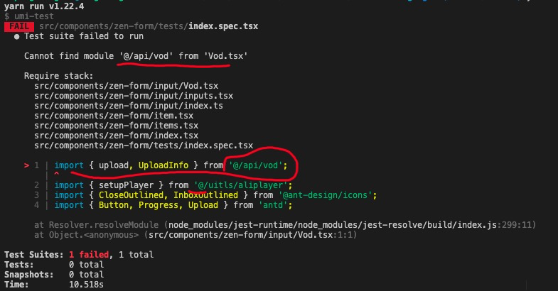

# jest 单元测试 报错，提示找不到@别名下的模块



## 问题

在 jest 单元测试中，如果需要测试代码中出现如 src 等我们设置的别名，jest 会报错，说找不到 module。

## 原因

jest 不识别 webpack 的别名，解决方式是在 jest 中配置 moduleNameMapper 属性，添加别名。

## 方式

可以选择在 package.json 中或者 jest 的配置文件里，添加配置

-   package.json

```json
"jest": {
    "moduleNameMapper": {
        "@/([^\\]*)$": "<rootDir>/src/$1"
    }
}
```

-   jest.config.js

```javascript
module.exports = {
    moduleNameMapper: {
        '@/([^\\]*)$': '<rootDir>/src/$1',
    },
};
```

## 解读

`moduleNameMaper`这个配置对象，它的 key 是一个 String，用`正则表达式`到模块名称或模块名称数组的映射。
对于上面这个示例，

-   key `"@/([^\\]*)$"`，这个正则，匹配以`@/`开头的模块，其中`[^\\]`限制了后续模块不能出现反斜杠，`()`捕获匹配项
-   value `"<rootDir>/src/$1"`，`<rootDir>`代表的是根目录，然后我们把`@/`就映射到根目录下的 src 目录，`$1`就是前面 捕获的匹配项。

因此，在 jest 测试中，`@/api/vod`等价于`../../../src/api/vod`(相对路径)。

## 最后

当然，除了 `@` 这个常见的别名以外，你还可以在`moduleNameMaper`配置中，添加更多的别名。它的 value 还支持数组的方式。eg：

```json
"moduleNameMapper": {
    "^image![a-zA-Z0-9$_-]+$": "GlobalImageStub",
    "^[./a-zA-Z0-9$_-]+\\.png$": "<rootDir>/RelativeImageStub.js",
    "module_name_(.*)": "<rootDir>/substituted_module_$1.js",
    "assets/(.*)": [
      "<rootDir>/images/$1",
      "<rootDir>/photos/$1",
      "<rootDir>/recipes/$1"
    ]
  }
}
```

## 参考

-   [使用模块的 Alias 别名来增强 Jest 的可配置度(完结) -- (PS：译文，中英)](https://www.jianshu.com/p/c26615b9be38)
-   [jest 官方文档 moduleNameMapper 配置项](https://jestjs.io/docs/en/configuration#modulenamemapper-objectstring-string--arraystring)
